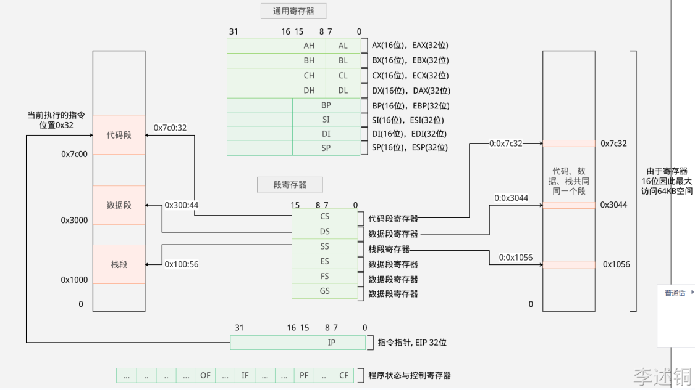
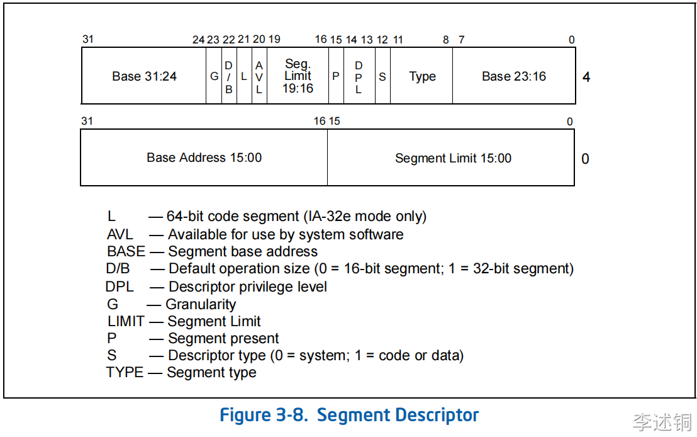

# 操作系统

## 一、x86保护模式

### 1. 引导操作系统


-   在电脑通电后，首先会执行主板中的BIOS代码，
-   在执行BIOS的代码中，会检测存储设备的第一个扇区中是否存在引导标志，引导标志存在，则会将引导程序加载到内存中执行。
    -   引导标志：对应扇区的最后两个字节位0x55,0xaa
    -   扇区大小为512字节，那么需要从第510个字节的位置写入引导标志
        

### 2. 16位 实模式



-   在段寄存器中存放对应段在内存的中的基址。
-   通过基址+偏移量访问，对应程序段在内存中的位置

    

#### 2.2通用寄存器

-   BP,SP : 栈相关
-   SI，DI：与数据拷贝相关

#### 2.3 16位平坦模式

指的是将代码段，数据段，栈放放在同一个段

方式： 将基址置0

-   无法直接将段寄存器置0，需要先在通用寄存器置0，然后再将数据存放到段寄存器中

```java
  mov $0, %ax
  mov %ax, %ds // 数据段寄存器
  mov %ax, %ss // 栈段寄存器
  mov %ax, %es // 附加段寄存器
  mov %ax, %gs // 附加段寄存器
  mov %ax, %fs // 附加段寄存器
```

#### 2.4 实模式中断

**中断**：中止执行当前程序，而是跳转到特定的地址，执行特定的代码。

-   实模式中，中断需要保护现场（存储当前程序的基地址（CS）以及偏移量（IP）），装载新的CS和IP执行对应的程序。

**中断的产生**

-   硬件中断：中断控制器发送电子信号，CPU对信号产生应答
-   软件中断： CPU执行INT指令，常数为软中断号

**中断的实现**

-   首先在内存中存放中断向量表，中断向量表存储中断处理程序的基地址。
-   IDTR寄存器：存放中断向量表的基地址和长度，指向内存中的中断向量表，以及判断中断处理程序地址是否越界


### 3. 保护模式

#### 3.1 保护模式特权级

为了区分哪些指令和哪些资源可以被访问，CPU实现了特权级。

特权级分为4级，R0-R3，R0可以执行所有指令， R1，R2，R3逐级递减


#### 3.2 段描述符



在当前的系统中，内存使用的仍然是分段模型，保护模式增加的是段的保护


32位保护模式中的段描述符有8个字节，64位，除了32位的基址，和20为的段长外，增加了12位的标志位，分表表示段的类型，段权限等信息。

由于32为最大表示的内存为4GB，而段长度只有20位，最多只能表示1GB，所以通过G标志符控制段长度的粒度，当G为1是，粒度为4KB ，此时（2^20 \* 2^12 = 2^32），此时段的大小至多为4gb&#x20;

```java
struct{uint16_t limit_l,base_l,base_m_attr, base_limit;}gdt_table[256] __attribute__((aligned(8))) = {
    //内核代码段基地址从0开始，大小为4GB，段粒度为4KB，段类型为代码段，特权级为0，不允许访问，不允许写入，不允许扩展方向，不允许执行
    [KERNEL_CODE_SEG / 8] = {0xffff, 0x0000,0x9a00,0xcf00},
    [KERNEL_DATA_SEG / 8] = {0xffff, 0x0000,0x9200,0xcf00},
};
```

-   `__attribute__((aligned(8)))` 是GCC编译器的一个特性，它的作用是将变量或结构体成员的内存对齐方式设置为8字节对齐。这样可以提高内存访问的效率，因为对齐的数据可以更快地被CPU读取。

#### 3.3全局段描述表（GDT）

-   多个**段描述符**在内存中形成**全局段描述表**。
-   在GDTR寄存器中存放段全GDT表的基址和长度


#### 3.4 段选择子

此时段寄存器不再存放基地址，而是存放段选择子（可以理解为段描述符在全局段描述符的索引）


-   影子寄存器： 为了减少性能损耗而设计的一个段描述符的高级缓存
